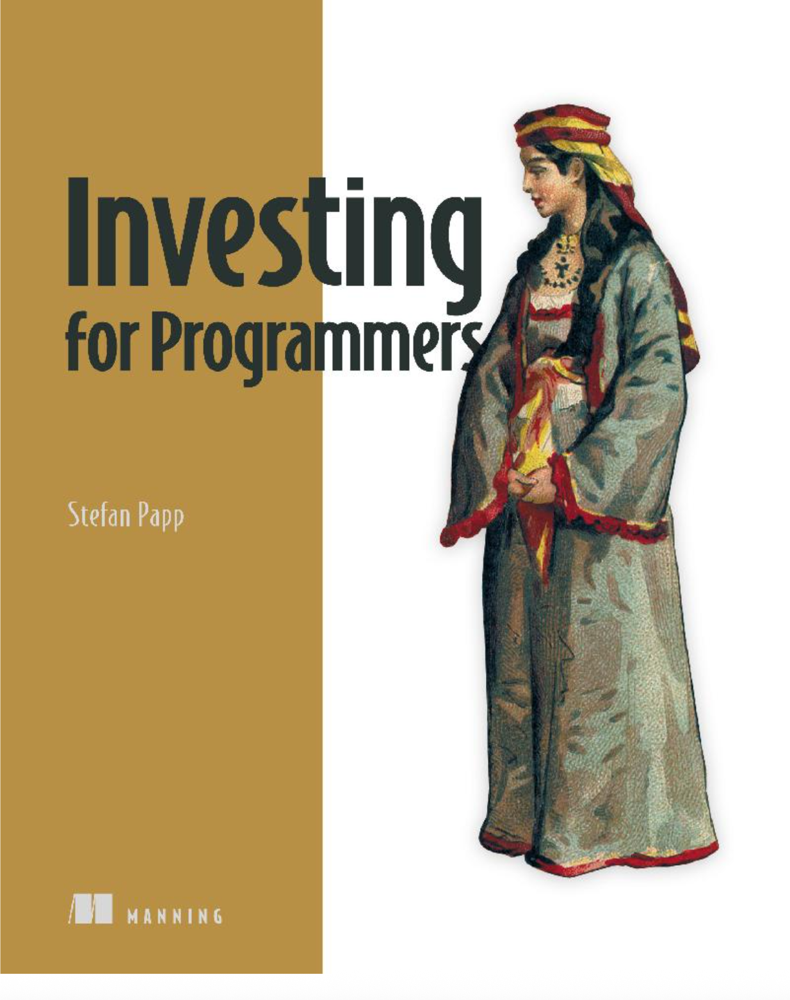

# Investing for Programmers - 中文版本



## 项目简介

本项目是《Investing for Programmers》书籍代码的中文翻译版本，主要展示如何使用编程方法进行股票投资分析。本版本针对中国股市进行了优化，使用 **Tushare** 替代原本的 **yfinance** 库来获取股票数据。

## 主要改进

### 数据源变更
- **原始版本**: 使用 `yfinance` 获取美股数据
- **中文版本**: 使用 `tushare` 获取中国A股数据

### 功能增强
- ✅ **解决了流动性比率数据缺失问题**
  - 手动计算 `current_ratio`（流动比率）
  - 手动计算 `quick_ratio`（速动比率）
- ✅ **适配中国股票市场**
  - 使用中国股票代码格式（如：000002.SZ, 600048.SH）
  - 支持A股特有的财务指标
- ✅ **银行业特殊处理**
  - 解释了银行股流动性比率的特殊性
  - 提供了针对银行业的财务指标解读

## 环境要求

### Python 版本
- Python 3.7+

### 核心依赖
```bash
pip install tushare pandas matplotlib jupyter
```

### Tushare Token 配置
1. 注册 [Tushare 账号](https://tushare.pro/)
2. 获取个人 Token
3. 设置环境变量：
```bash
export TUSHARE_TOKEN="你的_token_here"
```

或者在代码中设置：
```python
import os
os.environ['TUSHARE_TOKEN'] = '你的_token_here'
```

## 文件结构

```
investing-for-programmers-chn/
├── README.md                  # 项目说明文档
├── ch02_tushare.ipynb         # 第2章代码（Jupyter Notebook）
└── asset/
    └── book.png              # 书籍封面
```

## 使用方法

### 1. 运行 Jupyter Notebook
```bash
jupyter notebook ch02_tushare.ipynb
```

### 2. 主要功能模块

#### 流动性比率分析
```python
# 计算流动比率和速动比率
liquidity_data = calculate_liquidity_ratios('000002.SZ')
print(liquidity_data)
```

#### 财务指标获取
```python
# 获取股票财务数据
stock_codes = ['000002.SZ', '600048.SH', '002415.SZ']
financial_data = get_improved_stock_financial_data(stock_codes)
print(financial_data)
```

#### 估值分析
```python
# 获取估值指标（PE、PB、PS）
valuation_data = get_valuation_data(stock_codes)
print(valuation_data)
```

#### 股息分析
```python
# 获取股息数据
dividend_data = get_dividend_data(stock_codes)
print(dividend_data)
```

## 数据限制说明

### Tushare 数据局限性

1. **免费用户限制**
   - 每分钟最多 500 次调用
   - 每日最多 100,000 次调用
   - 部分高级数据需要付费

2. **数据完整性**
   - 部分小市值股票的财务数据可能不完整
   - 历史数据深度可能受限
   - 某些财务比率需要手动计算

3. **实时性**
   - 财务数据通常滞后 1-3 个月
   - 股价数据有 15 分钟延迟（免费版）

### 解决方案

- **流动性比率**: 已通过手动计算解决数据缺失问题
- **数据补全**: 建议使用多个数据源交叉验证
- **免费额度**: 合理规划 API 调用频率

## 银行业特殊说明

银行股的财务指标与传统行业不同：

- **流动比率**: 通常 < 1.0，这是正常现象
- **关注指标**: 资本充足率、存贷比、不良贷款率
- **解读方式**: 不能用传统标准判断银行业

详细说明请参考代码中的 `explain_bank_liquidity_ratios()` 函数。

## 扩展阅读

- [Tushare 官方文档](https://tushare.pro/document/)
- [《Investing for Programmers》原书](https://investingforprogrammers.com/)
- [中国股市投资指南](https://github.com/jzhang405/investing-for-programmers-chn)

## 许可证

本项目遵循原书代码的开源协议。

## 贡献

欢迎提交 Issue 和 Pull Request 来改进项目。

## 注意事项

⚠️ **投资风险提示**
- 本项目仅供学习和研究使用
- 不构成任何投资建议
- 投资有风险，入市需谨慎

⚠️ **数据准确性**
- 财务数据仅供参考
- 建议结合多个数据源进行验证
- 重要决策请咨询专业投资顾问

---

**作者**: 基于《Investing for Programmers》翻译改编
**版本**: v1.0 (基于 Tushare)
**更新时间**: 2024年12月
